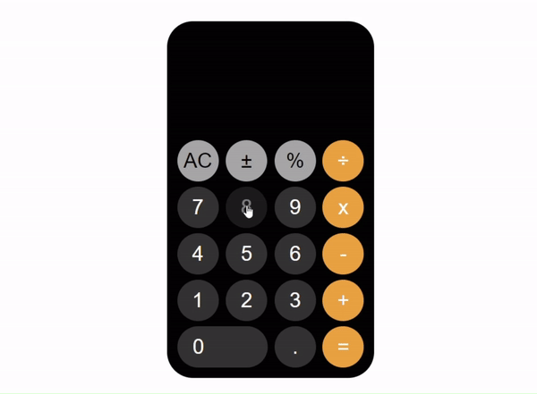

# iOS Calculator

https://omrfrkcpr.github.io/iOS_Calculator/

## Description

Project aims to create a calculator app.

## Problem Statement

- Your company has recently started on a project that aims to create a calculator. So you and your colleagues have started to work on the project.

## Project Skeleton

```
02-calculator(folder)
|
|----readme.md         # Given to the students (Definition of the project)
|----index.html
|----style.css
|----index.js
|----ios.gif
```

## Expected Outcome



## Objective

Create a Calculator that is functionally similar to the expected output

### At the end of the project, following topics are to be covered;

- HTML

- CSS

- JS

### At the end of the project, will be able to;

- improve coding skills within HTML & CSS & JS

- use git commands (push, pull, commit, add etc.) and Github as Version Control System.


<p align="center"> ⌛ Happy Coding  ✍ </p>
